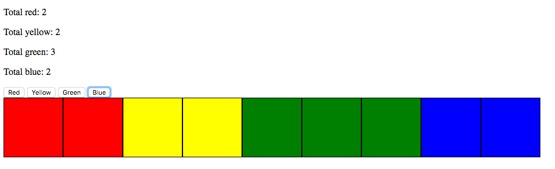
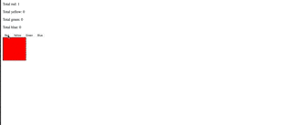

Color Blocks
===

In this challenge you will be creating an application that will create colored `<div>` tag each time the corresponding color is clicked. As each color (button) is clicked, it should increment the corresponding label. HTML and CSS are provided, the focus here is jQuery.

**IMPORTANT CONSIDERATIONS**

- _HTML and CSS are provided_ and shouldn't require code changes.
- You can use jQuery's `.data()` method to retrieve the `data-color` HTML attributes. [A relevant StackOverflow](http://stackoverflow.com/questions/5309926/how-to-get-the-data-id-attribute).
- Since the CSS is provided, you will need a jQuery method to apply a class to an element on the dom. A search that includes the technology and what you are trying to do should turn up something good. Try searching "_jquery apply css class to div_".

Base Mode:
---

Include JQuery in the project. Create and source in your JS file. Within, you'll need to create a click event for the "color-button" class which appends a div of class "color-cube" to the "container" div. 

Use the "data-color" from the clicked button to determine the new cube's color. 
Ex: if the user clicked the "Red" button, a red cube should be added to the DOM.

Finally, each ```span``` should have a count of how many of its cube are on the page. Ex: The user clicks the "Yellow" button - a new yellow cube is appended to the DOM and the ```span``` with id of "yellow" should increment by 1.

Starting this project
---
To start this code challenge fork this repository and clone it to your machine.

Application interface examples
---

Here is an image of how things should look:



Here is a gif of how things should like in action:



Hard Mode:
---

Add a feature so when a color block is clicked, it is removed from the DOM.

Also, the counts of the color blocks should update. 

Ex: There are 6 Blue cubes on the DOM. The user clicks one of the blue cubes. It disappears and the blue cube counter updates to 5.
        
Pro Mode:
--- 
Augment your your removal feature, by adding a delete button to each cube. When the delete button is clicked the cube that it is on should be removed. This will require some traversal. How do you get from the button to the block that contains it?


